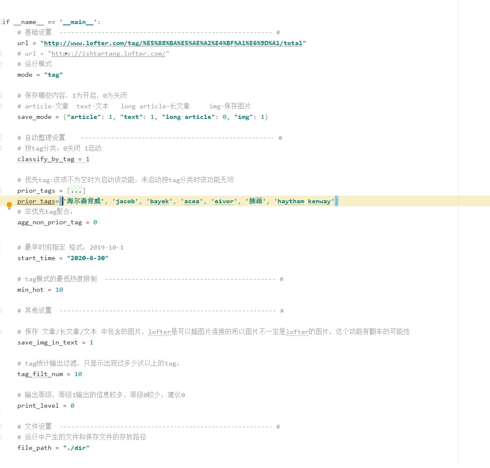
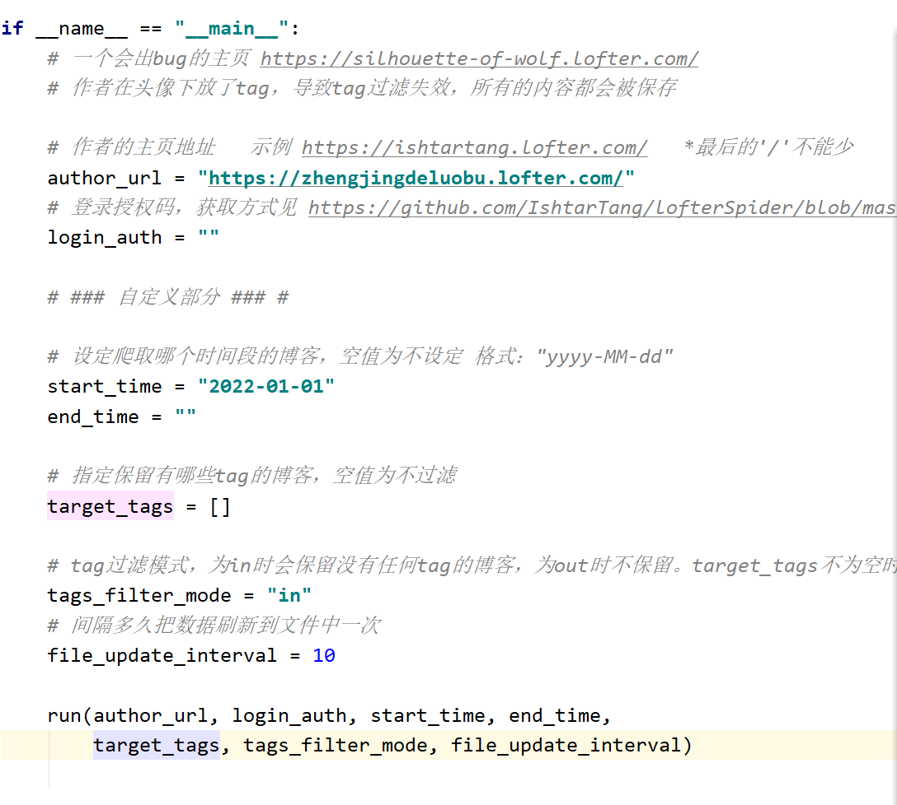

作者的bb：

有问题/报错提issue

不会提issue可以直接邮箱找我：ishtartang@163.com。得说清楚你用的哪个程序，报错爬的链接，报错长啥样(截图或者复制报错内容)，我debug起来比较方便。

------

以下是项目介绍：

项目中的内容一共是四种（可点击跳转）

1 . [**保存我的喜欢 & 保存我的推荐 & 保存tag下的内容**](#l13-保存我的喜欢-&-推荐-&-tag)

2 . [**保存一个作者发布的内容**](#l4-l9-保存作者主页内容)

3 . [**单篇保存**](#l8-l10单篇保存)

4 . 工具

**用到的第三方库：**requests  lxml urllib3 html2text

所有程序要设置的都在main里，划拉到程序最后面就是

保存作者和单篇保存是先写的，有些地方会比较粗糙

------

#### l13 保存我的喜欢 & 推荐 & tag

程序 l13_like_share_tag

##### 运行模式

共四种运行模式，like1, like2, share, tag

like1和like2：保存点过的喜欢，区别是2有一个额外的功能

share：保存所有点过的推荐

tag：保存一个tag里的内容

tag模式我只能爬到前1200条内容，后面的我弄不到了，有大佬知道怎么搞的话求告知，我请求的是这个

##### 保存模式

lofter的博客有5种类型，这个爬虫可以爬到文字、图片、长文章。音乐和视频我没想弄。

其中文字我分类成了有标题的和无标题的，有标题的叫文章，无标题的叫文本。

四种保存模式，图片，文章，文本，长文章

保存的图片的命名格式是 "作者名[作者三级域名] 发表时间(编号)"

三级域名就是每个人主页 https://xxxxxxx.lofter.com/  xxxxxx那一段，整这个是因为作者可能经常改名，但三级域名很少改，通过文件找作者的时候会方便很多。

保存的文章、文本、长文章的文件命名格式都是 "标题 by 作者.txt"

文件里有文件头信息和尾信息，头信息包括 标题，作者名，作者三级域名，发表时间，原文链接，该篇博客打的tag

如果文章里面带图片或者外链，链接会写在文件最后。有保存文章中图片的功能，后面说。

##### 使用

基本的使用只要设置三个地方，url，mode，save_mode

url：
like1 like2 share模式的url是你个人主页的链接。

tag模式需要的是tag链接。tag链接中有中文复制下来会变成编码，是正常的。

另外，链接中有的时候有表单，比如 http://www.lofter.com/like?act=qbdashboardlike_20121221_01 ，要把问号和后面的都删掉，变成 http://www.lofter.com/like 

mode：就是模式，like1 like2 share 和 tag

save_mode：保存模式，要保存哪些内容，见图

使用like1和share前需要把自己的lofter推荐和喜欢设为公开，非公开的话会爬不到

然后运行就行。

like2模式需要额外填写：

跟like1不一样，like2爬的是 http://www.lofter.com/like ，这个页面是登录后访问的，须要登录信息，另外，只支持手机登录的，邮箱的登录请求有加密我解不开。手机号就是手机号密码就是密码，授权码是一个叫LOFTER-PHONE-LOGIN-AUTH的cookie。开始时间是功能，在功能里说。

不知道去哪找cookies的看下面，知道的直接跳到功能选项部分。

点开lofter主页或者喜欢页，按F12召唤开发者工具，按Network，按XHR，往下划拉几下会加载一个文件，点它

点Cookies，找到一个叫LOFTER-PHONE-LOGIN-AUTH的，在它的值那里摁三下全选，拷到代码里就行

##### 功能选项

所有功能如果在生效阶段运行完后想要修改，必须将进度重置，重新运行该阶段

所有模式可用，只对图片和文章生效

| 功能          | 对应变量          | 变量类型 | 如何启动               | 具体描述                                                     | 生效阶段 | 备注                                                         |
| ------------- | ----------------- | -------- | ---------------------- | ------------------------------------------------------------ | :------- | ------------------------------------------------------------ |
| 按tag分类     | classify_by_tag   | 整型     | 1开启 0关闭            | 设作者打了 A,B,C 3个tag，启动该功能时会将该条博客的内容保存到名为A的文件夹下 | 阶段2    | 要爬的内容超过1000条时建议打开                               |
| 优先tag       | prior_tags        | 列表     | 列表非空时为启动该功能 | **未启动按tag分类时该功能无效** 设优先tag为C,B,D，作者打了A,B,C 三个tag，该条博客内容会按优先tag的顺序保存至文件夹 target/C 设优先tag为C,B,D，作者打了E,F,G 三个tag，按照作者第一顺位tag，保存至other/E下 | 阶段2    | 我自己整理了差不多200多个优先tag，个人建议顺序是cp - 角色 -作品 |
| 非优先tag聚合 | agg_non_prior_tag | 整型     | 1开启 0关闭            | **优先tag未启用时时该功能无效** 如果作者打的tag中不包含优先tag，博客内容保存到other文件夹下。1为启动，0为关闭。 | 阶段2    | /                                                            |

仅like2模式可用

开始时间指定让like2的可用性高了很多，比如第一次保存了所有点过的喜欢，一个星期后把时间设置为上次运行的日期，可以只爬这一个星期里点过的 。结束时间指定感觉没啥用所有没搞。

| 功能         | 对应变量   | 变量类型 | 如何启动           | 具体描述                                       | 生效阶段 | 备注                                       |
| ------------ | ---------- | -------- | ------------------ | ---------------------------------------------- | -------- | ------------------------------------------ |
| 开始时间指定 | start_time | 字符串   | 非空字符串时为启动 | 保存从指定时间到现在点过喜欢的博客，空为不指定 | 阶段1    | 格式为"yyyy-MM-dd" 举例："2020-02-01" |

仅tag模式可用

| 功能         | 对应变量名 | 变量类型 | 如何启动 | 具体描述                           | 生效阶段 | 备注 |
| ------------ | ---------- | -------- | -------- | ---------------------------------- | -------- | ---- |
| 最小热度限定 | min_hot    | 整形     | /        | 博客热度小于设定的热度则不会被爬取 | 阶段2    | /    |

其他选项

| 选项                               | 对应变量         | 变量类型 | 如何使用    | 具体描述                                                     | 生效阶段     | 备注                                                         |
| ---------------------------------- | ---------------- | -------- | ----------- | ------------------------------------------------------------ | ------------ | ------------------------------------------------------------ |
| 保存 文章/长文章/文本 中包含的图片 | save_img_in_text | 整型     | 1启动 0关闭 | 开启该功能后，会将文章中的图片保存到文章同已路径下，图片命名为文章标题+序号 | 阶段1        | 因为没有足够的文章用来测试所有这个功能出错的可能性挺高       |
| tag统计输出过滤                    | tag_filt_num     | 整型     | /           | 运行中会对所有博客的tag进行一个统计，输出出现次数超过设定次数的tag | 阶段3        | 可以当作优先tag的辅助功能，把输出的列表调整顺序后再放进代码里 |
| 输出等级                           | print_level      | 整型     | /           | 等级1的输出多，0的输出少                                     | 啥时候改都行 | 建议0，1会把每一条博客的信信息都输出来，除非你要debug不然0比较好。 |
| 文件设置                           | file_path        | 字符串   | /           | 所有文件的存放路径                                           | 阶段1        | 默认为./dir，一般不用改                                      |

##### 运行过程

运行完一个阶段会保存进度，会有文件标识这个阶段已经完成，可以删掉文件来手动调进度。

阶段1：获取喜欢/推荐/tag页面的原始数据，获取完成存到fav_info，然后从里面解析出需要的数据存到format_fav_info.json。
需要一点时间，我的一共8000多条，获取加解析大概6分钟。

format_fav_info.json文件出现表示阶段1已运行完成。

获取阶段的实际返回条数比请求条数少，因为你点过喜欢/推荐/tag中曾经存在的内容，有些已经被屏蔽或者作者删除的，也会计算进去，但实际上已经请求不到了，一般来说时间约久消失的条数越多。（我的少了1/10，fuck）

阶段2：

添加自动整理的信息，然后按照 图片、文章、文本、长文章分类，分类完后写到classified_fav_info.json。
大概一两秒。

classified_fav_info.json文件生成说明阶段2完成。

阶段3：对博客进行类型统计和tag统计，统计完后输出。很快，一两秒。

没有文件，目的是输出，每次运行都有这个阶段。

第三行是字典，每个tag具体出现了多少次，第四行是列表。
这有个小附加功能，用来辅助生成prior_tags的，具体看小工具 tags_tolist。

阶段3结束之后会暂停让你输个ok，退出就随便输点啥。

阶段4：保存

保存文章、保存文本、保存长文章很快，如果没开保存文本中的图片的话只要几秒就能运行完。
这三项没有进度文件，所以保存中断再启动会从头开始保存。

保存图片能自己记录进度，保存图片的时候断掉重启的话会自动读上次的进度，进度在img_save_info.json。
需要的时间比较长，查不多20-40分钟1000条图片博客，主要看图片多少。

如果图片存到一半，停止，修改了自动整理选项再启动的话，进度会自己重置到阶段2（这是整个程序唯一自动调进度的地方）

保存完成后有个问你删不删文件的，要是保存完了yes就行。
要是比如说你第一次没存长文章，跑完了突然又想存就no，再启动会从阶段3开始跑。

------

#### l4 l9 保存作者主页内容

l4_author_img.py 和 l9_author_txt.py

l4是保存作者发布的所有图片，l9是保存所有文章和文本，有标题没标题的都可以

l4_author_img

 l9_author_txt.py

这两挺像，因为l9就是拿l4改的，还从l4调了一堆方法

功能在注释里都写了，不做自定义设置的话把作者主页链接拷到author_url，运行就行

 爬到的图片会在`./dir/img/作者名 `里面，图片命名方式是 `作者名[作者lof的三级域名]-发表时间(序号)` 

文章在`dir/article/作者名`里，文件命名格式是 `标题 by 作者`；
文本和文章在同一路径，文件命名格式是 `作者 发表日期（序号）`

------

#### l8 l10单篇保存

l8_blogs_img.py 和 l10_blogs_txt.py

这两没有要改代码的地方，改的是对应的文件，文件在./dir中

l8 对应 img_list
l10 对应 txt_list

使用方法相同，把单篇的链接放进文件里，一行一个，直接运行程序就行

这两个是我以前用得最多的，不过保存喜欢的写出来之后就没怎么用了

#### 工具

tags_tolist.py：

这个是对l13生成prior_tag的一个辅助功能

在l13运行了一次阶段3之后会在./dir里面生成一个prior_tags.txt文件，里面是所有博客中tag数从多到少的排序，是tag过滤后的。

可以在里面排序/删除，排完运行tags_tolist.py会把你排好的变成列表（这里示范一下，没排），把输出的列表直接拷到prior_tag就行

为了避免排好之后忘记导出来就运行l13把文件覆盖掉，prior_tags.txt这个文件只会在文件不存在时生成，重新生成需要把文件删掉。

parse_template.py：这个是l9和l10的xpath文字匹配模板，放着就行

useragentutil.py：随机获取请求头，放着就行
