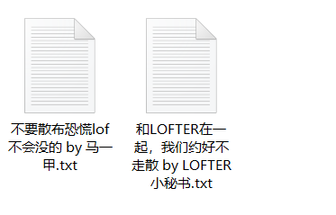

### 写前边

啥都不会的去把小白教程看一遍。

要提issue或者使用中遇到问题不知道怎么办，先把文档最后的**问题反馈与支持指南**看完。

### 项目介绍

项目中程序按功能分类为以下几种（可以点击跳转）

1 . [**保存我的喜欢 & 保存我的推荐 & 保存tag下的内容（pc端）**](#l13-保存我的喜欢--推荐--tag )

2 . [**保存tag下的内容（手机端）（未完成）**](#l15-保存tag手机端未完成)

3 . [**保存一个作者发布的内容（pc端）**](#l4-l9-保存作者主页内容)

4 . [**单篇保存（pc端）**](#l8-l10单篇保存)

5 . [**主页扫描（pc端）**](#l14-从主页提取所有博客链接含仅自己可见)

所有程序要设置的都在main里，划拉到程序最后面就是

------

#### 填写登录信息

使用任何对pc端的程序都要先填这个，这里填好可以同步到每个程序，不填其他的都跑不起来

点开文件 login_info.py

#####  登录方式 和 login_key 对应表

| 登录方式                 | login_key               |
| ------------------------ | :---------------------- |
| lofter id 登录           | Authorization           |
| 手机号登录               | LOFTER-PHONE-LOGIN-AUTH |
| QQ登录/微信登录/微博登录 | LOFTER_SESS             |
| 邮箱登录                 | NTES_SESS               |

##### 获取login_auth方式1

点开lofter主页或者喜欢页，按F12打开控制台，按Network，按XHR，往下划拉几下会加载一个文件（如果加载失败就看下面的方式2），点它

点Cookies，找你登录方式的 login_key，比如这里是用手机登录，所以就找LOFTER-PHONE-LOGIN-AUTH，把右边的值复制下来，粘贴到代码里

##### 获取login_auth方式2

只要是登录了之后lofter站内任意网页就行，在没打开控制台的情况下刷新，再按F12打开控制台，按Application，按cookies，点开cookies展开后的lofter链接。找你登录方式的 login_key，这张图是微信登录，就找LOFTER-SESS，把右边的值复制下来，粘贴到代码里

#### l13 保存我的喜欢 & 推荐 & tag

程序 l13_like_share_tag

##### 运行模式

共四种运行模式，`like1`, `like2`, `share`, `tag`

`like1`和`like2`：保存点过的喜欢，区别是2有一个额外的功能

`share`：保存所有点过的推荐

`tag`：保存一个tag里的内容（有数量限制，具体看`基本使用` - `url`）

##### 基本使用

基本使用只要设置三个地方，url，mode，save_mode

###### url

`like1`、 `like2 `和 `share` 模式的url是你个人主页的链接。链接中有的时候有表单，比如 https://ishtartang.lofter.com/?act=qbdashboardlike_20121221_01 ，要把问号和后面的都删掉，变成 https://ishtartang.lofter.com/ 。

tag模式需要的是tag链接，tag链接有5种结尾，分别是 最新(new)、热度总榜(total)、月榜(month)、周榜(week)，日榜(date)，想爬哪个放哪个，浏览器直接点进tag的链接是没有结尾的，会指向最新。

tag链接中有中文复制下来会变成编码，是正常的。

 

tag模式能获取到的条数有限制，new的上限是1099，所有热度榜的上限500。这个限制不是bug，不是技术问题，是Lofter就只让访问这么多，你手动去web端翻它也就是显示这么多（这个程序刚写出来的时候所有的获取上限都是1200，但总之呢lofter这些年又多搞了些限制）。

已经找到能获取更多的办法，得用移动端端口，难搞，我自己没这个需求，没程序基础的人弄不到移动端cookie，所以不打算写。

###### mode

启用哪种模式，`like1`、 `like2`、 `share` 和 `tag`

使用`like1`和`share`前需要把自己的lofter推荐和喜欢设为公开，非公开的话可能会爬不到

###### save_mode

保存模式，要保存哪些内容

lofter的博客有5种类型，这个爬虫可以爬到文字、图片、长文章。音乐和视频我没想弄。

文字我分类成了有标题的和无标题的，有标题的叫文章，无标题的叫文本。

四个保存项，1为保存，0为不保存。如图中设置就是：保存文章、文本、图片，不保存长文章

保存的图片的命名格式是 "作者名[作者三级域名] 发表时间(编号)"

三级域名就是每个人主页 https://xxxxxxx.lofter.com/  xxxxxx那一段，整这个是因为作者可能经常改名，但三级域名很少改，通过文件找作者的时候会方便很多。

保存的文章、文本、长文章的文件命名格式都是 "标题 by 作者.txt"

文件里有文件头信息和尾信息，头信息包括 标题，作者名，作者三级域名，发表时间，原文链接，该篇博客打的tag

如果文章里面带图片或者外链，链接会写在文件最后。有保存文章中图片的功能，后面说。

##### 更多功能选项

所有功能如果在生效阶段运行完后想要修改，必须将进度重置，重新运行该阶段

所有模式可用，只对图片和文章生效

| 功能          | 对应变量          | 变量类型 | 如何启动               |                           具体描述                           | 生效阶段 | 备注                                          |
| ------------- | ----------------- | -------- | ---------------------- | :----------------------------------------------------------: | :------- | --------------------------------------------- |
| 按tag分类     | classify_by_tag   | 整型     | 1开启 0关闭            | 设作者打了 A,B,C 3个tag，启动该功能时会将该条博客的内容保存到名为A的文件夹下 | 阶段2    | 开了好整理                                    |
| 优先tag       | prior_tags        | 列表     | 列表非空时为启动该功能 | **未启动按tag分类时该功能无效** 设优先tag为C,B,D，作者打了A,B,C 三个tag，该条博客内容会按优先tag的顺序保存至文件夹 target/C 设优先tag为C,B,D，作者打了E,F,G 三个tag，按照作者第一顺位tag，保存至other/E下 | 阶段2    | 按你自己需要来就行，我的顺序是cp - 角色 -作品 |
| 非优先tag聚合 | agg_non_prior_tag | 整型     | 1开启 0关闭            | **优先tag未启用时时该功能无效** 如果作者打的tag中不包含优先tag，博客内容保存到other文件夹下。1为启动，0为关闭。 | 阶段2    | /                                             |

仅like2模式可用

开始时间指定让like2的可用性高了很多，比如第一次保存了所有点过的喜欢，一个星期后把时间设置为上次运行的日期，可以只爬这一个星期里点过的 。

| 功能         | 对应变量   | 变量类型 | 如何启动           | 具体描述                                       | 生效阶段 | 备注                                       |
| ------------ | ---------- | -------- | ------------------ | ---------------------------------------------- | -------- | ------------------------------------------ |
| 开始时间指定 | start_time | 字符串   | 非空字符串时为启动 | 保存从指定时间到现在点过喜欢的博客，空为不指定 | 阶段1    | 格式为"yyyy-MM-dd" 举例："2020-02-01" |

仅tag模式可用

| 功能         | 对应变量名 | 变量类型 | 如何启动 | 具体描述                           | 生效阶段 | 备注 |
| ------------ | ---------- | -------- | -------- | ---------------------------------- | -------- | ---- |
| 最小热度限定 | min_hot    | 整形     | /        | 博客热度小于设定的热度则不会被爬取 | 阶段2    | /    |

其他选项

| 选项                               | 对应变量         | 变量类型 | 如何使用    | 具体描述                                                     | 生效阶段     | 备注                                                   |
| ---------------------------------- | ---------------- | -------- | ----------- | ------------------------------------------------------------ | ------------ | ------------------------------------------------------ |
| 保存 文章/长文章/文本 中包含的图片 | save_img_in_text | 整型     | 1启动 0关闭 | 开启该功能后，会将文章中的图片保存到文章同已路径下，图片命名为文章标题+序号 | 阶段1        | 因为没有足够的文章用来测试所有这个功能出错的可能性挺高 |
| tag统计输出过滤                    | tag_filt_num     | 整型     | /           | 运行中会对所有博客的tag进行一个统计，输出出现次数超过设定次数的tag | 阶段3        | 用来看                                                 |
| 输出等级                           | print_level      | 整型     | /           | 设为1会把每一条博客的信信息都输出来，正常用0就行             | 啥时候改都行 | debug用的                                              |
| 文件设置                           | file_path        | 字符串   | /           | 所有文件的存放路径                                           | 阶段1        | 默认为./dir，不用动                                    |

##### 运行过程（这是给我自己的笔记，只是使用的话没必要看）

运行完一个阶段会保存进度，会有文件标识这个阶段已经完成，可以删掉文件来手动调进度。

阶段1：获取喜欢/推荐/tag页面的原始数据，获取完成存到fav_info，然后从里面解析出需要的数据存到format_fav_info.json。
需要一点时间，我的一共8000多条，获取加解析大概6分钟。

format_fav_info.json文件出现表示阶段1已运行完成。

获取阶段的实际返回条数比请求条数少，因为你点过喜欢/推荐/tag中曾经存在的内容，有些已经被屏蔽或者作者删除的，也会计算进去，但实际上已经请求不到了，一般来说时间约久消失的条数越多。

阶段2：

添加自动整理的信息，然后按照 图片、文章、文本、长文章分类，分类完后写到classified_fav_info.json。
大概一两秒。

classified_fav_info.json文件生成说明阶段2完成。

阶段3：对博客进行类型统计和tag统计，统计完后输出。很快，一两秒。

没有文件，目的是输出，每次运行都有这个阶段。

第三行是字典，每个tag具体出现了多少次，第四行是列表。
这有个小附加功能，用来辅助生成prior_tags的，具体看小工具 tags_tolist。

阶段3结束之后会暂停让你输个ok，退出就随便输点啥。

阶段4：保存

保存文章、保存文本、保存长文章很快，如果没开保存文本中的图片的话只要几秒就能运行完。
这三项没有进度文件，所以保存中断再启动会删掉已经保存的文件重新开始保存。

保存图片能自己记录进度，保存图片时断掉重启的话会自动读上次的进度，进度在img_save_info.json。
需要的时间比较长，差不多20-40分钟1000条图片博客，主要看图片多少。

如果图片存到一半，停止，修改了自动整理选项再启动的话，进度会自己重置到阶段2（这是整个程序唯一自动调进度的地方）

保存完成后有个问你删不删文件的，要是保存完了yes就行。
要是比如说你第一次没存长文章，跑完了突然又想存就no，再启动会从阶段3开始跑。

------

#### l15 保存tag（手机端）（未完成）

手机端能获取到tag的信息比pc端多很多，热榜能获取到1000条，而且能获取历史月份的热榜，就很好，但我没什么兴致和时间写完这个。 

获取tag页信息和博客页信息的接口都搞定了，距离这个程序基本能使还差博客页信息提取&图片下载（博客页信息还是json就挺好），但总之我懒得写了，开始许愿有好心人帮我写完。

好吧只是说说而已我很久没用过lofter了对这个没多大需求，写这个只是随便抓个APP练手，总之你需要的话可以在l15的基础上写你要的用的。

现在的结构其实也欠了点，感觉应该弄个自动把历史月份热榜全扫一编的，有几个参数应该移到get_tag_data去，但我懒得写。

 

#### l4 l9 保存作者主页内容

l4_author_img.py 和 l9_author_txt.py

l4是保存作者发布的所有图片，l9是保存所有文章和文本，有标题没标题的都可以

 

功能在注释里都写了，不做自定义设置的话把作者主页链接拷到author_url，运行就行

 爬到的图片会在`./dir/img/作者名 `里面，图片命名方式是 `作者名[作者lof的三级域名]-发表时间(序号)` 

文章在`dir/article/作者名`里，文件命名格式是 `标题 by 作者`；
文本和文章在同一路径，文件命名格式是 `作者 发表日期（序号）`

这两爬的是**归档页**，归档页**不显示仅自己可见**，所以即使登录也爬不到你主页仅自己可见的内容，要存仅自己可见去试试l14配合l8或l10

两程序挺像，因为l9就是拿l4改的，还从l4调了一堆方法，如果我什么时候有时间有兴致就把它两二合一

------

#### l8 l10单篇保存

l8_blogs_img.py 和 l10_blogs_txt.py

这两没有要改代码的地方，改的是对应的文件，文件在./dir中

l8 对应 img_list
l10 对应 txt_list

使用方法相同，把单篇的链接放进文件里，一行一个，直接运行程序就行

这两个是我以前用得最多的，不过保存喜欢的写出来之后就没怎么用了

------

#### l14 从主页提取所有博客链接（含仅自己可见）

从这个程序的行数你就能看出它写得很粗糙，但能使就行

如果是要存自己主页（含仅自己可见）的内容，先运行l14，运行完后把links.txt的内容复制到 img_list / txt_list，再运行l8/l10就行

##  问题反馈与支持指南

#### 程序报错

不要只发报错信息给我！说清楚你用的**哪个程序**，爬的**哪个链接**，最好直接把**程序的配置界面截图**和**报错截图**发过来，我debug起来比较方便。

我知道有的人不想让我知道你爬了些啥，但你只发报错信息我就得搁那推为什么报这个错，修完还得找测试用例，不要增加我的工作量好吗。

#### issue

考虑到有小白，这里说一下，使用中遇到不明白的、程序报错、有其它问题找我都可以提issue，上面菜单栏里点**Issues**，然后点绿色的**New issue**，把你的问题填进去再点**Create**，要还是弄不明白怎么提issue或者你就是不想让别人看你写了啥可以邮箱找我：[ishtartang@163.com](mailto:ishtartang@163.com)，但不要在提了issue之后又给我发邮件。

#### 程序更新

我最开始写这个程序是因为我要用，现在已经不怎么用lofter了，程序出问题还是会修，但不会很及时。

有的时候会懒得更新自述文件，如果自述文件和代码注释冲突以代码注释为准。

如果有什么想要的功能可以说，我觉得有必要或者心情好会在有空的时候写。但是不要建议我写什么功能，除非你的建议跟着pull request或者给我发工资。

#### 不要跟我讲这些

不要特地来跟我说觉得程序结构可以优化！我当然知道可以优化啊我现在看一个函数传十几个参我也觉得眼前一黑，这个项目里第一个程序写出来时我刚开始学爬虫，现在修结构唯一作用就是显得我很闲。

