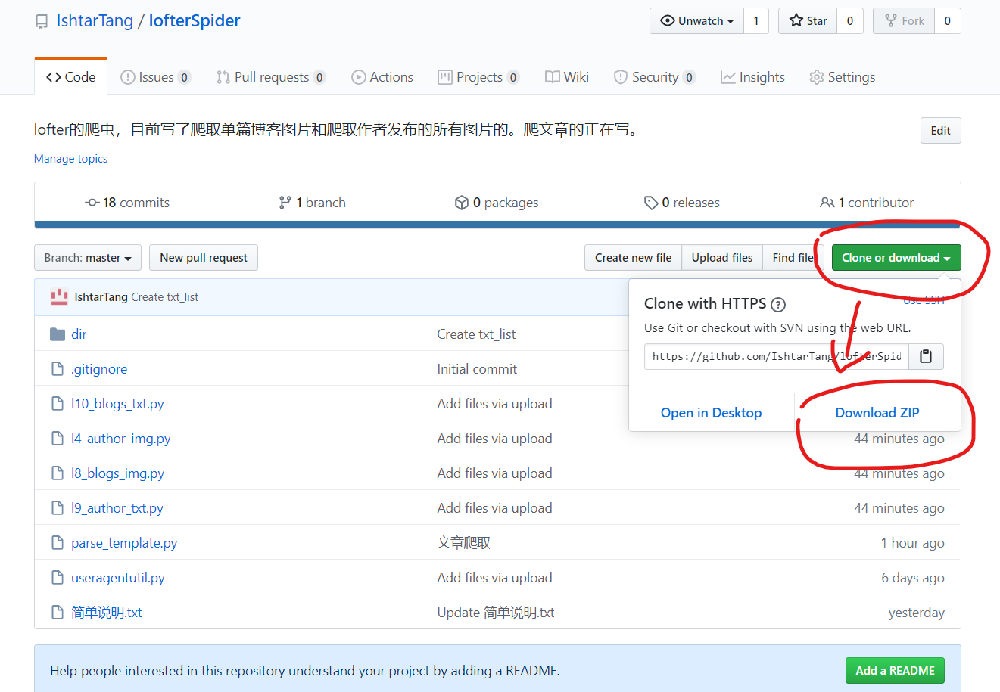

这部分是教完全不会编程的人如何运行程序。

我假设你没有任何编程基础，没用过cmd没运行过python不知道github电脑上啥都没有。

首先你得装个python的编译器

百度云链接 https://pan.baidu.com/share/init?surl=mEgh6Ti0FBjk6MEwCjBiTw  提取码：ltib ，或者你去python官网下  https://www.python.org/downloads/ ，

安装把 Add Python 3.7 to Path钩上，选Install Now，就行

按 win + r，会弹出来这个

输入 cmd  回车，跳出命令行界面

输入 python 回车

这样即为python安装成功

输入 exit()  ，从python退出来

依次输入

pip install requests
pip install lxml
pip install urllib3
pip install json5

这是安装运行程序所需要的依赖包

会有三种情况

一种是有进度条，最后会有successful，为成功(因为我都安好了所以没图)
一种是already satisfied，已经安装过，也算成功

一种是有红色字体，为失败，一般是网不好，多试几次

要是卡住了可以按 Ctrl + c 强制退出，重新输入

到此为止环境配置完成

下载程序，下载键在这

下载，解压

接下来有两分支，一个是命令行运行，一个是用软件运行，我个人还是推荐用软件，方便些，不想下的就用命令行吧

软件PyCharm：

到官网下 https://www.jetbrains.com/pycharm/ ，选社区版的，专业版的只有三十天试用，或者百度云盘https://pan.baidu.com/s/1cJrlMB2RQQrmaYSPIqKorA 提取码：x5yr 

安装：这里把这三项钩上，其他的都直接next，最后install

安装完要重启，选立刻重启

命令行：

打开文件夹，用记事本打开你要用的那个程序，划拉到最后按设置改，具体看README，改好在路径栏里输入 cmd 然后回车

输 python + 文件名，就能运行了，嫌文件名长可以就打个开头然后按 Tab键，可以自动补全

l4_author_img 和 l8_blogs_img 这两个我已经用了挺久的，应该不会有问题，l9_author_txt 和 l10_blogs_txt 都是今天才完成的，可能会容易出问题写。特别是有个模板0，爬的文章有不全的可能性，如果出现了可以把你爬的博客链接发给我，我再改改试试。 