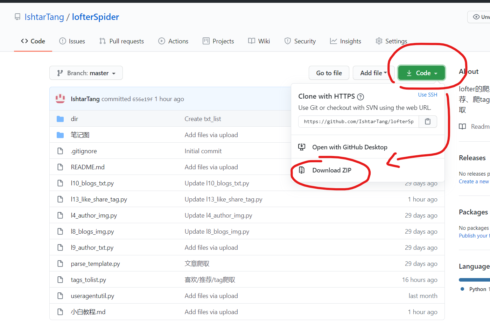

这部分是教完全不会编程的人如何运行程序。

我假设你没有任何编程基础，没用过命令行没运行过python程序没上过github电脑上啥都没有。

文档里的图可能加载不出来，建议科学上网

##### github

下载在这

下载好好了解压出来，不能在压缩包里运行

README.md是说明文档，页面直接向下划拉也是。

##### 变量类型

解释一下变量类型，免得设置的时候设置错：

整形，就是数字 比如：

i1 = 1

i2 = 100

字符串，平常打的字，要用双引号或者英文单引号括起来，数字被括起来也是字符串，比如

x1 = "唐文"

x2 = "123"

x3 = "may the father of understanding guide us"

列表，就是放在一起的一堆元素，用中括号括起来，逗号分割，长度不限。python的列表放啥都行，比如：

list1 = [1,2,3]

list2 = ["test1","test2","fu*k"]

特别说明的一点是，空列表是list3这样

list3 = []

list4这种不是空列表，tag过滤里要是写成这样会导致啥都保存不下来

list4 = [""]

所有的符号都是英文符号，中文符号会报错

 

##### 运行

首先你得装个python的编译器

去python官网下  https://www.python.org/downloads/ ，或者百度云 https://pan.baidu.com/share/init?surl=mEgh6Ti0FBjk6MEwCjBiTw  提取码：ltib 

安装把 Add Python 3.7 to Path钩上，选Install Now就行

安装完按 win + r，会弹出来这个

输入 cmd  回车，跳出命令行界面

输入 python 回车

这样即为python安装成功

输入 exit()  ，从python退出来

依次输入

pip install requests

pip install lxml

pip install urllib3

pip install json5

pip install html2text

pip install numpy

这是安装运行程序所需要的依赖包

会有三种情况

一种是有进度条，最后会有successful，为成功(因为我都安好了所以没图)

一种是already satisfied，已经安装过，也算成功

一种是有红色字体，为失败，一般是网不好，多试几次

要是卡住了可以按 Ctrl + c 强制退出，重新输入

到此为止环境配置完成

接下来有两分支，一个是命令行运行，一个是用软件运行，我个人还是推荐用软件，看得到报错，顺手些，不想下的就用命令行吧

软件PyCharm：

到官网下 https://www.jetbrains.com/pycharm/ ，选社区版的，专业版的只有三十天试用，或者百度云盘https://pan.baidu.com/s/1cJrlMB2RQQrmaYSPIqKorA 提取码：x5yr 

安装：这里把这三项钩上，其他的都直接next，最后install

安装完要重启，选立刻重启

重启后打开，选open，按路径找到项目位置，或者直接把项目位置放到路径栏，ok

右下角会有个进度条让它跑完，点开左边的文件可以看到程序，

点开你要用的，确认一下没有任何红线，特别是最上面import的几行。

useragentutil有红线没关系，看着不顺眼的话，在没加粗的lofterSpider-master文件夹右键，Mark Directory as — Sources Root

划拉到最后，修改设置，右键，RUN

下面会弹出运行进度

阶段2运行完之后输个ok，然后放着就行，断了的话，可能是被lofter发现是个爬虫，直接重新运行就行，好几次在同一个地方断掉的话就是真的bug，可以找我。

命令行：

打开文件夹，用记事本打开你要用的那个程序，划拉到最后按设置改，具体看README，改好在路径栏里输入 cmd 然后回车

输 python + 文件名，就能运行了，嫌文件名长可以就打个开头然后按 Tab键，可以自动补全

